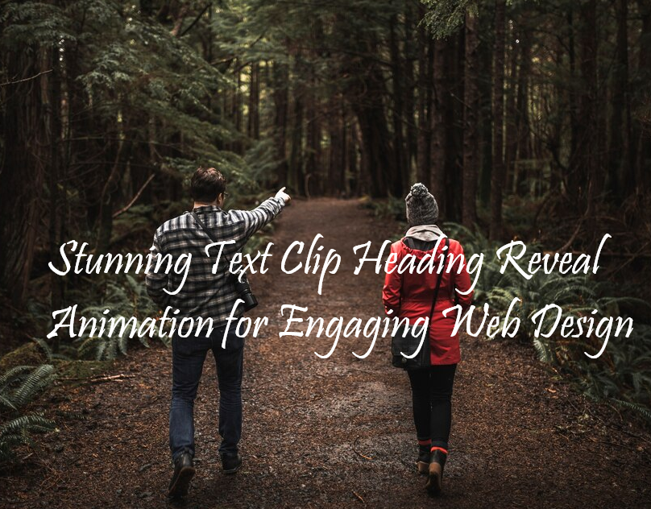

# Stunning Text Clip Heading Reveal Animation for Engaging Web Design

<a href="https://www.linkedin.com/in/dharmendraverma95/" target="_blank">LinkedIn Profile </a>

<a href="https://www.behance.net/dhirukumar" target="_blank">Behance Profile </a>

This project demonstrates how to create dynamic and engaging Text Clip Heading Reveal Animations for web pages. These animations add a modern touch to your website by revealing headings with a stylish, clip-based effect that captivates your audience.

### Features
<ul>
  <li>Text Clip Effect: Create a visually appealing animation where the text of the heading is gradually revealed.
</li>
  <li>CSS-Based Animations: Achieve smooth, eye-catching animations using only CSS.</li>
  <li>Easy to Implement: Minimal setup required, just add the provided code to your website.</li>
</ul>

# Preview
Desktop Design
 

 

 

 
UI UX Layout Design

 
Cover Design

 
###### Lang
<ul>
  <li>Graphic Design Software: Photoshop, Figma (for mockups)</li>
  <li>Web Tools (Optional): HTML5, CSS3 for any digital presentations or landing pages</li>
</ul>

